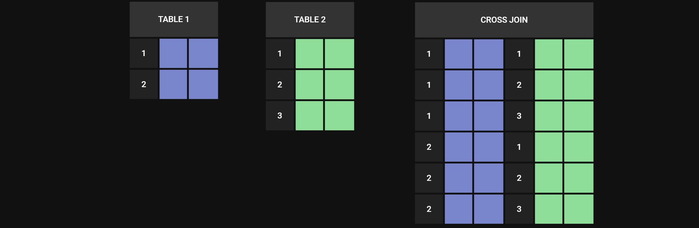
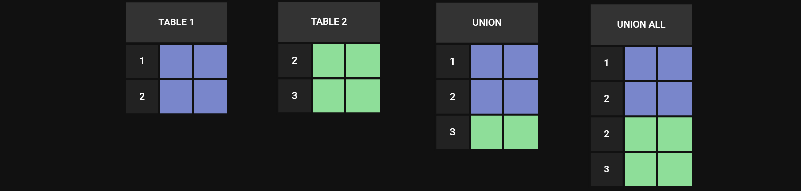

# SQL

[habr.com](https://habr.com/ru/articles/564390/#%D0%BA%D0%BE%D0%BC%D0%B0%D0%BD%D0%B4%D1%8B-sql) \
[SQL ACADEMY](https://sql-academy.org/ru/trainer) \
[ITResume](https://itresume.ru/problems)

- [DATABASE STRUCTURE](#database-structure)
- [DATA TYPES](#data-types)
    - [`PRIMARY KEY` / `FOREIGN KEY`](#primary-key--foreign-key)
- [REQUEST STRUCTURE](#request-structure)
    - [`SELECT`](#select)
    - [`FROM`](#from)
    - [`WHERE`](#where)
    - [`GROUP BY`](#group-by)
    - [`HAVING`](#having)
    - [`ORDER BY`](#order-by)
    - [`LIMIT`](#limit)
- [FUNCTIONS](#functions)
    - [STANDARD FUNCTIONS](#standard-functions)
        - [`COUNT` / `SUM` / `AVG` / `MIN` / `MAX`](#count--sum--avg--min--max)
    - [STRING FUNCTIONS](#string-functions)
        - [`CHAR`](#char) 
        - [`CONCAT`](#concat)
        - [`INSTR`](#instr)
        - [`LEFT`](#left)
        - [`LENGTH`](#length)
        - [`LOCATE`](#locate)
        - [`LPAD`](#lpad)
        - [`LTRIM`](#ltrim)
        - [`REPEAT`](#repeat)
        - [`REPLACE`](#replace)
        - [`REVERSE`](#reverse)
        - [`RIGHT`](#right)
        - [`RPAD`](#rpad)
        - [`RTRIM`](#rtrim)
        - [`SUBSTRING`](#substring)
        - [`TRIM`](#trim)
        - [`UPPER`](#upper)
    - [NUMERIC FUNCTIONS](#numeric-functions)
        - [`ABS`](#abs)
        - [`CEILING`](#ceiling)
        - [`COS`](#cos)
        - [`EXP`](#exp)
        - [`FLOOR`](#floor)
        - [`GREATEST`](#greatest)
        - [`LEAST`](#least)
        - [`LOG`](#log) 
        - [`MOD`](#mod) 
        - [`PI`](#pi) 
        - [`POW`](#pow) 
        - [`RAND`](#rand) 
        - [`ROUND`](#round) 
        - [`SIGN`](#sign) 
        - [`SIN`](#sin)
        - [`SQRT`](#sqrt)
        - [`TAN`](#tan) 
        - [`TRUNCATE`](#truncate)
    - [DATE TIME FUNCTIONS](#date-time-functions)
        - [DATE TIME TYPES AND FORMATS]()
        - [`ADDDATE`](#adddate)
        - [`CURDATE`](#curdate)
        - [`CURTIME`](#curtime)
        - [`DATE`](#date)
        - [`DATE_FORMAT`](#dateformat)
        - [`DATEDIFF`](#datediff)
        - [`DAY`](#day)
        - [`DAYNAME`](#dayname)
        - [`DAYOFWEEK`](#dayofweek)
        - [`HOUR`](#hour)
        - [`MINUTE`](#minute)
        - [`MONTH`](#month)
        - [`MONTHNAME`](#monthname)
        - [`NOW`](#now)
        - [`STR_TO_DATE`](#strtodate)
        - [`SUBDATE`](#subdate)
        - [`TIMEDIFF`](#timediff)
        - [`TIMESTAMPADD`](#timestampadd)
        - [`TIMESTAMPDIFF`](#timestampdiff)
        - [`YEAR`](#year)
    - [ADVANCED FUNCTIONS](#advanced-functions)
        - [`CAST`](#cast)
        - [`COALESCE`](#coalesce)
        - [`IF`](#if)
        - [`IFNULL`](#ifnull)
        - [`ISNULL`](#isnull)
        - [`NULLIF`](#nullif)
        - [`WITH`](#with)
    - [WINDOW FUNCTIONS](#window-functions)
        - [`DENSE_RANK`](#denserank)
        - [`FIRST_VALUE`](#firstvalue)
        - [`LAG`](#lag)
        - [`LAST_VALUE`](#lastvalue)
        - [`LEAD`](#lead)
        - [`RANK`](#rank)
        - [`ROW_NUMBER`](#rownumber)
    - [CUSTOM FUNCTIONS](#custom-functions)
- [STORED PROCEDURE](#stored-procedure)
- [OPERATORS](#operators)
- [JOIN OPERATIONS](#join-operations)
    - [`INNER JOIN`](#inner-join)
    - [`LEFT JOIN`](#left-join)
    - [`RIGHT JOIN`](#right-join)
    - [`FULL JOIN`](#full-join)
    - [`CROSS JOIN`](#cross-join)
    - [`NATURAL JOIN`](#natural-join)
    - [`SELF JOIN`](#self-join)
- [TYPIFICATION](#typification)
- [`UNION`](#union)
- [`EXCEPT`](#except)
- [`INTERSECT`](#intersect)
- [VIEWS](#views)

## DATABASE STRUCTURE

| DB OBJECTS  | DESCRIPTION                                                                                                                                                                                                             |
|-------------|-------------------------------------------------------------------------------------------------------------------------------------------------------------------------------------------------------------------------|
| `TABLE`     | таблицы содержат данные, которые хранятся в БД. Это основной объект.                                                                                                                                                    |
| `INDEX`     | индексы используются для увеличения производительности в операциях поиска и выборки данных.  [INFO](https://postgrespro.ru/docs/postgresql/13/indexes)                                                                  |
| `SEQUENCE`  | объект БД, предназначенный для генерации значений, которые используются в качестве значений полей в записях таблицы. [INFO](https://postgrespro.ru/docs/postgresql/13/functions-sequence)                               |
| Constraints | ограничение - объект БД, предназначенный для проверки значений полей таблиц при их создании и изменении. [INFO](https://postgrespro.ru/docs/postgresql/13/ddl-constraints)                                              |
| `PROCEDURE` | позволяют программировать на уровне самой БД (формально — на уровне СУБД), то есть БД содержат средства компиляции программного кода. Поэтому можно часть алгоритмов вынести на уровень БД                              |
| `TRIGGER`   | объект БД, представляющий собой механизм вызова некоторой процедуры при наступлении некоторого события. Событием может быть создание, удаление или изменение записи таблицы. Триггеры применяются к конкретной таблице. |
| `VIEW`      | это виртуальная таблица, которая обычно содержит связанные данные из нескольких таблиц и используется для удобства запросов данных.                                                                                     |

## DATA TYPES

| DATA TYPE          | DESCRIPTION                                                              |
|--------------------|--------------------------------------------------------------------------|
| `BIGINT`           | -9,223,372,036,854,775,808 ... 9,223,372,036,854,775,807                 |
| `INT`              | -2,147,483,648 ... 2,147,483,647                                         |
| `SMALLINT`         | 	-32,768 ... 32,767                                                      |
| `TINYINT`          | 0 ... 255                                                                |
| `BIT`              | 0 ... 1                                                                  |
| `DECIMAL`          | -10^38 +1 ... 10^38 -1                                                   |
| `NUMERIC`          | -10^38 +1 ... 10^38 -1                                                   |
| `MONEY`            | -922,337,203,685,477.5808 ... +922,337,203,685,477.5807                  |
| `SMALLMONEY`       | -214,748.3648 ... +214,748.3647                                          |
| `FLOAT`            | -1.79E + 308 ... 1.79E + 308                                             |
| `REAL`             | -3.40E + 38 ... 3.40E + 38                                               |
| `DATETIME`         | Jan 1, 1753 ... Dec 31, 9999                                             |
| `SMALLDATETIME`    | Jan 1, 1900 ... Jun 6, 2079                                              |
| `DATE`             | Дата сохраняется в виде June 30, 1991                                    |
| `TIME`             | Время сохраняется в виде 12:30 P.M.                                      |
| `CHAR`             | Строка длиной до 8,000 символов (не-юникод символы, фиксированной длины) |
| `VARCHAR`          | Строка длиной до 8,000 символов (не-юникод символы, переменной длины)    |
| `TEXT`             | Не-юникод данные переменной длины, длиной до 2,147,483,647 символов      |
| `NCHAR`            | Строка длиной до 4,000 символов (юникод символы, фиксированной длины)    |
| `NVARCHAR`         | Строка длиной до 4,000 символов (юникод символы, переменной длины)       |
| `NTEXT`            | Юникод данные переменной длины, длиной до 1,073,741,823 символов         |
| `BINARY`           | Данные размером до 8,000 байт (фиксированной длины)                      |
| `VARBINARY`        | Данные размером до 8,000 байт (переменной длины)                         |
| `IMAGE`            | Данные размером до 2,147,483,647 байт (переменной длины)                 |
| `TIMESTAMP`        | Уникальные числа, обновляющиеся при каждом изменении строки              |
| `UNIQUEIDENTIFIER` | Глобально-уникальный идентификатор (GUID)                                |
| `CURSOR`           | Объект курсора                                                           |
| `TABLE`            | Промежуточный результат, предназначенный для дальнейшей обработки        |

### PRIMARY KEY / FOREIGN KEY

```sql
CREATE TABLE matches(
    id INT NOT NULL PRIMARY KEY,
    home_team_api_id INT NOT NULL FOREIGN KEY REFERENCES teams(api_id),
    away_team_api_id INT NOT NULL FOREIGN KEY REFERENCES teams(api_id)
    );
```

## REQUEST STRUCTURE

| CMD        | DESCRIPTION                                                                                       |
|------------|---------------------------------------------------------------------------------------------------|
| `SELECT`   | определяет данные для извлечения                                                                  |
| `FROM`     | определяет таблицу для извлечения данных                                                          |
| `WHERE`    | определяет фильтрацию до агрегирования данных                                                     |                                                    
| `GROUP BY` | используется для определения групп выходных строк, к которым могут применяться агрегатные функции |
| `HAVING`   | определяет фильтрацию уже агрегированных данных                                                   |
| `ORDER BY` | определяет порядок вывода строк в запросе                                                         |

### SELECT

```sql
SELECT -- / SELECT DISTINCT
    director,
    movie_title,
    10 - rating AS difference
FROM sql.kinopoisk
```

### FROM

```sql
SELECT *
FROM
    sql.teams,
    sql.matches
```

### WHERE

```sql
SELECT *
FROM sql.kinopoisk
WHERE (rating BETWEEN 8 AND 8.5 OR year < 1990)
    AND overview IS NOT NULL
    AND movie_title NOT LIKE 'Т%'
    AND movie_title LIKE '____________'
```

### GROUP BY

```sql
SELECT
   type1 primary_type,
   count(DISTINCT type2) additional_types_count,
   AVG(hp) avg_hp,
   SUM(attack) attack_sum
FROM sql.pokemon
GROUP BY primary_type
ORDER BY additional_types_count DESC, primary_type
```

### HAVING

```sql
SELECT
    type1, 
    COUNT(*)
FROM sql.pokemon
WHERE attack BETWEEN 50 AND 100 OR defense BETWEEN 50 AND 100
GROUP BY type1
HAVING MAX(hp) <= 125
ORDER BY COUNT(*) DESC
LIMIT 1 OFFSET 4
```

### ORDER BY

```sql
SELECT
    director,
    movie_title
FROM sql.kinopoisk
ORDER BY year, rating DESC -- / ASC
OFFSET 3 LIMIT 1
```

### LIMIT

```sql
SELECT *
FROM sql.kinopoisk
OFFSET 3 LIMIT 5
```

## FUNCTIONS

### STANDARD FUNCTIONS

| FUNCTION [INFO](https://postgrespro.ru/docs/postgrespro/11/functions-aggregate) | DESCRIPTION                                                                   |
|---------------------------------------------------------------------------------|-------------------------------------------------------------------------------|
| `AVG`                                                                           | вычисляет среднее значение                                                    |
| `SUM`                                                                           | вычисляет сумму значений                                                      |
| `MIN`                                                                           | вычисляет наименьшее значение                                                 |
| `MAX`                                                                           | вычисляет наибольшее значение                                                 |
| `COUNT`                                                                         | вычисляет количество записей в таблице                                        |
| `CONCAT`                                                                        | объединение строк                                                             |
| `LENGTH`                                                                        | возвращает количество символов в строке                                       |
| `TRIM`                                                                          | удаляет пробелы в начале и конце строки                                       |
| `SUBSTRING`                                                                     | извлекает подстроку из строки                                                 |
| `REPLACE`                                                                       | заменяет подстроку в строке                                                   |
| `LOWER`                                                                         | переводит символы строки в нижний регистр                                     |
| `UPPER`                                                                         | переводит символы строки в верхний регистр и т.д.                             |
| `ROUND`                                                                         | округляет число                                                               |
| `TRUNCATE`                                                                      | обрезает дробное число до указанного количества знаков после запятой          |
| `CEILING`                                                                       | возвращает наименьшее целое число, которое больше или равно текущему значению |
| `FLOOR`                                                                         | возвращает наибольшее целое число, которое меньше или равно текущему значению |
| `POWER`                                                                         | возводит число в указанную степень                                            |
| `SQRT`                                                                          | возвращает квадратный корень числа                                            |
| `RAND`                                                                          | генерирует случайное число с плавающей точкой в диапазоне от 0 до 1           |
| `CURDATE` `CURRENT_DATE`                                                        | возвращает текущую дату                                                       |
| `CURTIME` `CURRENT_TIME`                                                        | возвращает текущее время                                                      |
| `DAYOFMONTH(date)`                                                              | возвращает день месяца в виде числа                                           |
| `DAYOFWEEK(date)`                                                               | возвращает день недели в виде числа                                           |
| `DAYOFYEAR(date)`                                                               | возвращает номер дня в году                                                   |
| `MONTH(date)`                                                                   | возвращает месяц                                                              |
| `YEAR(date)`                                                                    | возвращает год                                                                |
| `LAST_DAY(date)`                                                                | возвращает последний день месяца в виде даты                                  |
| `HOUR(time)`                                                                    | возвращает час                                                                |
| `MINUTE(time)`                                                                  | возвращает минуты                                                             |
| `SECOND(time)`                                                                  | возвращает секунды                                                            |
| `DATE_ADD(date, interval)`                                                      | выполняет сложение даты и определенного временного интервала                  |
| `DATE_SUB(date, interval)`                                                      | выполняет вычитание из даты определенного временного интервала                |
| `DATEDIFF(date1, date2)`                                                        | возвращает разницу в днях между двумя датами                                  |
| `TO_DAYES(date)`                                                                | возвращает количество дней с 0-го дня года                                    |
| `TIME_TO_SEC(time)`                                                             | возвращает количество секунд с полуночи                                       |
| `DATE_FORMAT(date, format)`                                                     | форматирования даты                                                           |
| `TIME_FORMAT(date, format)`                                                     | форматирования времени                                                        |

#### COUNT / SUM / AVG / MIN / MAX

```sql
SELECT
    COUNT(*) pokemon_count,
    AVG(speed) avg_speed,
    MAX(hp) max_hp,
    MIN(hp) min_hp
FROM sql.pokemon
WHERE type1 = 'Electric'
    AND type2 IS NOT NULL
    AND (attack > 50 OR defense > 50)
```

### STRING FUNCTIONS

#### CHAR

Возвращает строку, созданную путем объединения последовательности из ASCII

```sql
CHAR(num, [num,])
```

```sql
SELECT CHAR(72, 105);
-- Hi
```

#### CONCAT

Возвращает строку, созданную путем объединения всех аргументов

```sql
CONCAT(str, [str,] ...)
```

Если хотя бы один из аргументов равен `NULL`, возвращается значение `NULL`.

```sql
SELECT CONCAT('q', 'w', 'e');
-- qwe
SELECT CONCAT('qwe', NULL);
-- <NULL>
```

#### INSTR

Возвращает позицию первого вхождения подстроки в строку

```sql
INSTR(str, substr)
```

```sql
SELECT INSTR('qwE', 'E');
-- 3
```

#### LEFT

Возвращает заданное количество крайних левых символов строки

```sql
LEFT(str, number_of_characters)
```

```sql
SELECT LEFT('qwe-asd', 3);
-- qwe
```

#### LENGTH

Возвращает длину строки

```sql
LENGTH(str)
```

```sql
SELECT LENGTH('qwe')
-- 3
```

#### LOCATE

Возвращает позицию первого вхождения подстроки в строку

```sql
LOCATE(substr, str, [strat_position])
```

`substr` - искома подстрока \
`str` - строка, в которой ищется подстрока \
`start_position` - Позиция начала строки

```sql
SELECT LOCATE('qwe', 'qwe asd')
-- 1
SELECT LOCATE('qwe', 'qwe asd', 2)
-- 0
```

#### LOWER

Возвращает строку, в которой все символы записаны в нижнем регистре

```sql
LOWER(str)
```

```sql
SELECT LOWER('QWE')
-- qwe
```

#### LPAD

Возвращает строку, дополненную слева другой строкой до указанной длины

```sql
LPAD(str, len, pad_str)
```

`str` - исходная строка \
`len` - длина строки, до которой будет дополняться строка \
`pad_str` - строка, которой будет дополняться исходная строка

```sql
SELECT LPAD('9', 4, '0');
-- 0009
```

#### LTRIM

Возвращает строку, у которой удалены все пробелы с левого края

```sql
LTRIM(str)
```

```sql
SELECT LTRIM('     qwe')
-- qwe
```

#### REPEAT

Возвращает строку, полученную из заданного количества повторней строки

```sql
REPEAT(str, count)
```

```sql
SELECT REPEAT('q ', 3);
-- q q q 
```

#### REPLACE

Возвращает строку, в которой все подстроки заменены другой подстрокой

```sql
REPLACE(str, from_str, to_str)
```

`str` - исходная строка
`from_str` - подстрока, которая будет заменена
`to_str` - подстрока, которая заменит

```sql
SELECT REPLACE('qwe asd', 'qwe', 'asd');
-- asd
```

#### REVERSE

Возвращает строку, записанную в обратном порядке

```sql
REVERSE(str)
```

```sql
SELECT REVERSE('qwe');
-- ewq
```

#### RIGHT

Возвращает заданное количество крайних правых символов строки

```sql
RIGHT(str, number_of_characters)
```

```sql
SELECT RIGHT('qwe-asd', 3);
-- asd
```

#### RPAD

Возвращает строку, дополненную справа другой строкой до указанной длины

```sql
RPAD(str, len, pad_str)
```

`str` - исходная строка \
`len` - длина строки, до которой будет дополняться строка \
`pad_str` - строка, которой будет дополняться исходная строка

```sql
SELECT RPAD('9', 4, '0');
-- 9000
```

#### RTRIM

Возвращает строку, у которой удалены все пробелы с правого края

```sql
RTRIM(str)
```

```sql
SELECT RTRIM('qwe        ')
-- qwe
```

#### SUBSTRING

Возвращает подстроку, начинающуюся с указанной позиции [и имеющую определенную длину]

```sql
SUBSTRING(str, pos [,len])
```

`str` - исходная строка \
`pos` - позиция, с которой будет начинаться подстрока \
`len` - опциональный, длина полученной подстроки

```sql
SELECT SUBSTRING('123456789', 5);
-- 56789
SELECT SUBSTRING('123456789', 1, 3);
-- 123
```

#### TRIM

Возвращает строку, у которой удалены все пробелы с левого и правого края

```sql
TRIM(str)
```

```sql
SELECT TRIM('     qwe       ')
-- qwe
```

#### UPPER

Возвращает строку, в которой все символы записаны в верхнем регистре

```sql
UPPER(str)
```

```sql
SELECT UPPER('qwe')
-- QWE
```

### NUMERIC FUNCTIONS

#### ABS

Возвращает абсолютное значение числа

```sql
ABS(num)
```

```sql
SELECT ABS(-2);
-- 2
```

#### CEILING

Возвращает число, округленное до большего целого

```sql
CEILING(num)
```

```sql
SELECT CEILING(0.2);
-- 1
SELECT CEILING(-0.2);
-- 0
```

#### COS

Возвращает косинус угла, заданного в радианах

```sql
COS(angle)
```

```sql
SELECT COS(PI()/2);
-- 6.123233995736766e-17
```

#### EXP

Возвращает `e` в указанной степени

```sql
EXP(1)
```

```sql
SELECT EXP(1);
-- 2.718281828459045
```

#### FLOOR

Возвращает число, округленное до меньшего целого

```sql
FLOOR(num)
```

```sql
SELECT FLOOR(-0.2);
-- -1
SELECT FLOOR(0.2);
-- 0
```

#### GREATEST

Возвращает максимальное значение из списка

```sql
GREATEST(num [,num])
```

```sql
SELECT GREATEST(1, 2, -1);
-- 2
```

#### LEAST

Возвращает минимальное значение из списка

```sql
LEAST(num [,num])
```

```sql
SELECT LEAST(1, 2, -1);
-- -1
```

#### LOG

Возвращает логарифм числа

```sql
LOG(base, num)
```

`base` - основание алгоритма \
`num` - число, от которого берется алгоритм

```sql
SELECT LOG(10, 100);
-- 2
```

#### MOD

Возвращает остаток от деления

```sql
MOD(dividend, divisor)
```

`dividend` - делимое
`divisor` - делитель

```sql
SELECT MOD(7, 3);
-- 1
```

#### PI

Возвращает значение числа pi

```sql
PI()
```

```sql
SELECT PI();
-- 	3.141593
```

#### POW

Возвращает число в указанной степени

```sql
POW(num, power)
```

`num` - число, которое возводиться в степень \
`power` - степень числа

```sql
SELECT POW(2, 3);
-- 8
```

#### RAND

Возвращает случаное значение с плавающей точкой в диапазоне от 0.0 до 1.0

```sql
RAND([num])
```

```sql 
SELECT RAND();
-- 0.6390186600750486
```

#### ROUND

Возвращает число, округленное до указанного количества знаков после запятой

```sql
ROUND(num, [decimals])
```

`num` - исходное дробное число \
`decimals` - количество знаков после запятой для округления числа

```sql
SELECT ROUND(22.29);
-- 22
SELECT ROUND(22.29, 1);
-- 22.3
```

#### SIGN

Возвращает знак переданного числа: -1 для отрицательный значений, 1 для положительных и 0 для 0

```sql
SIGN([num])
```

```sql
SELECT SIGN(-13);
-- -1
SELECT SIGN(13);
-- 1
SELECT SIGN(0);
-- 0
```

#### SIN

Возвращает синус угла, заданного в радианах

```sql
SIN(angle)
```

`angle` - угол, заданный в радианах

```sql
SELECT SIN(PI()/2);
-- 1
```

#### SQRT

Возвращает квадратный корень от числа

```sql
SQRT(num)
```

```sql
SELECT SQRT(4);
-- 2
```

#### TAN

Возвращает тангенс угла, заданного в радианах

```sql
TAN(angle)
```

`angle` - угол, заданный в радианах

```sql
SELECT TAN(PI()/2);
-- 16331239353195370
```

#### TRUNCATE

Возвращает число, округленное до указанного количества знаков после запятой путем отбрасования последующих цифр

`num` - исходное дробное число \
`decimals` - количество знаков после запятой для округления числа

```sql
SELECT TRUNCATE(22.29, 0);
-- 22
SELECT TRUNCATE(22.29, 1);
-- 22.2
SELECT TRUNCATE(22.29, -1);
-- 20
SELECT TRUNCATE(22.29, -2);
-- 0
```

### DATE TIME FUNCTIONS

#### DATETIME TYPES AND FORMATS

| TYPE                | DESCRIPTION                                | 	FORMAT               |
|---------------------|--------------------------------------------|-----------------------|
| MICROSECOND         | 	Микросекунды                              | 	хxxxxx               |
| SECOND              | 	Секунды                                   | 	ss                   |
| MINUTE	             | Минуты	                                    | mm                    |
| HOUR                | 	Часы                                      | 	hh                   |
| DAY                 | 	Дни                                       | 	DD                   |
| WEEK                | 	Недели	                                   | WW                    |
| MONTH	              | Месяцы                                     | 	MM                   |
| QUARTER	            | Квартал                                    | 	QQ                   |
| YEAR                | 	Год	                                      | YY                    |
| SECOND_MICROSECOND  | 	Секунды и микросекунды	                   | "ss.xxxxxx"           |
| MINUTE_MICROSECOND	 | Минуты, секунды и микросекунды	            | "mm:ss.xxxxxx"        |
| MINUTE_SECOND       | 	Минуты и секунды	                         | "mm:ss"               |
| HOUR_MICROSECOND    | 	Часы, минуты, секунды и микросекунды      | 	"hh:mm:ss.xxxxxx"    |
| HOUR_SECOND         | 	Часы, минуты и секунды	                   | "hh:mm:ss"            |
| HOUR_MINUTE	        | Часы и минуты	                             | "hh:mm"               |
| DAY_MICROSECOND     | 	Дни, часы, минуты, секунды и микросекунды | 	"DD hh:mm:ss.xxxxxx" |
| DAY_SECOND	         | Дни, часы, минуты и секунды                | 	"DD hh:mm:ss"        |
| DAY_MINUTE          | 	Дни, часы и минуты	                       | "DD hh:mm"            |
| DAY_HOUR            | 	Дни и часы                                | 	"DD hh"              |
| YEAR_MONTH	         | Года и месяцы	                             | "YY-MM"               |

| DETERMINANT	 | DESCRIPTION                                                    |
|--------------|----------------------------------------------------------------|
| %a           | 	Сокращенное наименование дня недели (Sun...Sat)               |
| %b	          | Сокращенное наименование месяца (Jan...Dec)                    |
| %c	          | Месяц в числовой форме (1...12)                                |
| %D           | 	День месяца с английским суффиксом (1st, 2nd, 3rd и т. д.)    |
| %d           | 	День месяца в числовой форме с ведущим нулем (01..31)         |
| %e           | 	День месяца в числовой форме (1..31)                          |
| %f           | 	Микросекунды (000000..999999)                                 |
| %H           | 	Час с ведущим нулем (00..23)                                  |
| %h           | 	Час с ведущим нулем (01..12)                                  |
| %I           | 	Час с ведущим нулем (01..12)                                  |
| %i           | 	Минуты с ведущим нулем (00..59)                               |
| %j           | 	День года (001..366)                                          |
| %k           | 	Час с ведущим нулем (0..23)                                   |
| %l           | 	Час без ведущего нуля (1..12)                                 |
| %M           | 	Название месяца (January...December)                          |
| %m           | 	Месяц в числовой форме с ведущим нулем (01..12)               |
| %p           | 	AM или PM (для 12-часового формата)                           |
| %r           | 	Время, 12-часовой формат (hh:mm:ss AM                         |hh:mm:ss PM)|
| %S           | 	Секунды (00..59)                                              |
| %s           | 	Секунды (00..59)                                              |
| %T           | 	Время, 24-часовой формат (hh:mm:ss)                           |
| %U           | 	Неделя (00..52), где воскресенье считается первым днем недели |
| %u           | 	Неделя (00..52), где понедельник считается первым днем недели |
| %W           | 	Название дня недели (Sunday...Saturday)                       |
| %w           | 	День недели (0...6), 0 — Воскресенье, 6 — Суббота             |
| %Y           | 	Год в 4 разряда ГГГГ                                          |
| %y           | 	Год в 2 разряда ГГ                                            |

#### ADDDATE

Возвращает дату, к которой прибавлен временной интервал, определяемы вторым параметром

```sql
ADDDATE(datetime, INTERVAL value unit)
```

`datetime` - исходная дата \
`value` - количество прибавляемого интервала времени \
`unit` - прибавляемый интервал времени, одно из следующих значений MICROSECOND, SECOND, MINUTE, HOUR, DAY, WEEK, MONTH,
QUARTER, YEAR

```sql
SELECT ADDDATE('2007-01-01', INTERVAL 10 DAY);
-- 2007-01-11
```

#### CURDATE

Возвращает текущую дату в формате ГГГГ-MM-ДД 00:00:00

```sql
CURDATE()
```

```sql
SELECT CURDATE();
-- 2007-01-01T00:00:00.000Z
```

#### CURTIME

Возвращает текущее время суток в формате ЧЧ:ММ:СС

```sql
CURTIME()
```

```sql
SELECT CURTIME();
-- 10:00:00
```

#### DATE

Извлекает из значения даты и времени суток в формате ГГГГ-MM-ДД ЧЧ:ММ:СС дату, отсекая часы, минуты и секунды

```sql
DATE(datetime)
```

```sql
SELECT DATE("2022-12-05 10:37:22");
-- 2022-12-05T00:00:00.000Z
```

#### DATE_FORMAT

Форматирует дату и время в соответствии с заданными параметрами

```sql
DATE_FORMAT(datetime, format)
```

`datetime` - исходная дата/время \
`format` - формат для использования

```sql
SELECT DATE_FORMAT("2007-01-01 16:00:03", "START AT %d %b, %H:%i") as date_format;
-- START AT 01 Jan, 16:00
```

#### DATEDIFF

Возвращает разницу в днях между датами. При вычислении разницы используется дата, время не используется.

```sql
DATEDIFF(datetime1, datetime2)
```

```sql
SELECT DATEDIFF('2007-01-10','2007-01-01');
-- 9
```

#### DAY

Возвращает порядковый номер дня в месяце (от 1 до 31)

```sql
DAY(datetime)
```

```sql
SELECT DAY("2022-06-16");
-- 16
```

#### DAYNAME

Возвращает день недели в виде полного названия

```sql
DAYNAME(datetime)
```

```sql
SELECT DAYNAME("2022-06-16");
--Thursday
```

#### DAYOFWEEK

Возвращает порядковый номер дня в неделе (от 1 до 7), начиная с воскресенья

```sql
DAYOFWEEK(datetime)
```

```sql
SELECT DAYOFWEEK("2022-06-16");
-- 5
```

#### HOUR

Возвращает значение часа (от 0 до 23) для времени

```sql 
HOUR(datetime)
```

```sql
SELECT HOUR('2022-06-16 16:37:03');
-- 16
```

#### MINUTE

Возвращает значение минут (от 0 до 59) для времени

```sql
MINUTE(datetime)
```

```sql
SELECT MINUTE('2022-06-16 16:37:03');
-- 37
```

#### MONTH

Возвращает числовое значение месяца года (от 1 до 12)

```sql
MONTH(datetime)
```

```sql
SELECT MONTH("2022-06-16");
-- 6
```

#### MONTHNAME

Возвращает строку с названием месяца для даты

```sql
MONTHNAME(datetime)
```

```sql
SELECT MONTHNAME("2022-06-16");
-- June
```

#### NOW

Возвращает текущую дату в формате ГГГГ-MM-ДД ЧЧ:ММ:СС

```sql
NOW()
```

```sql
SELECT NOW()
-- 	2000-01-01T11:05:14.000Z
```

#### STR_TO_DATE

Возвращает дату и время на основании строки и формата

```sql
STR_TO_DATE(string, format)
```

`string` - и сходная строка с датой \
`format` - формат строки, описывающей дату

```sql
SELECT STR_TO_DATE('November 13, 1998', '%M %d, %Y');
-- 1998-11-13T00:00:00.000Z
```

#### SUBDATE

Возвращает дату, из которой вычетается временной интервал, определяемый вторым параметром

```sql
SUBDATE(datetime, INTERVAL value unit)
```

`datetime` - исходная дата \
`value` - количество вычитаемого интервала времени \
`unit` - вычитаемый интервал времени, одно из следующих значений MICROSECOND, SECOND, MINUTE, HOUR, DAY, WEEK, MONTH,
QUARTER, YEAR

```sql
SELECT SUBDATE('2022-06-16', INTERVAL 10 DAY);
-- 2022-06-06
```

#### TIMEDIFF

Возвращает разницу во времени (datetime1 - datetime2) между DATETIME или TIME значениями. Результат возвращается в
формате ЧЧ:ММ:СС.

```sql
TIMEDIFF(datetime1, datetime2)
```

Возвращает `NULL`, если одно из переданных значений равно `NULL` или оба значения имеют разным тип

```sql
SELECT TIMEDIFF('2022-12-05 18:00:00','2022-12-05 14:00:00');
-- 04:00:00
SELECT TIMEDIFF('18:00:00','14:00:00');
-- 04:00:00
SELECT TIMEDIFF('18:00:00','2022-12-05 14:00:00')
-- <NULL>
```

#### TIMESTAMPADD

Возвращает значение после прибавления к одной даты/времени другой даты/времени

```sql
TIMESTAMPADD(unit, value, datetime)
```

`unit` - прибавляемый интервал времени, одно из следующих значений MICROSECOND, SECOND, MINUTE, HOUR, DAY, WEEK, MONTH,
QUARTER, YEAR \
`value` - число прибавляемых указанных интервалов \
`datetime` - исходная дата/время

```sql
SELECT TIMESTAMPADD(HOUR, 3, "2022-12-05 10:37:22") as date;
-- 2022-12-05 13:37:22
```

#### TIMESTAMPDIFF

Возвращает разницу между двумя DATE или DATETIME в конкретной единице измерения

```sql
TIMESTAMPDIFF(unit, datetime1, datetime2)
```

`unit` - единица измерения, в которой нужно вернуть разницу между значениями \
`datetime1` - значение, которое будет вычитаться из `datetime2` \
`datetime2` - значение, из которого будет вычитаться `datetime1`

```sql
SELECT TIMESTAMPDIFF(YEAR,'2012-06-12','2022-12-05');
-- 10
SELECT TIMESTAMPDIFF(DAY,'2012-06-12','2022-12-05');
-- 3828
```

#### YEAR

Возвращает год для указанной даты

```sql
YEAR(datetime)
```

```sql
SELECT YEAR("2022-06-16");
-- 2022
```

### ADVANCED FUNCTIONS

#### CAST

Конвертирует значение в указанный тип данных

```sql
CAST(value AS type)
```

`value` - значение для конвертации
`type` - тип данных для конвертации

| TYPE              | 	DESCRIPTION                                                                                                                                                                                |
|-------------------|---------------------------------------------------------------------------------------------------------------------------------------------------------------------------------------------|
| DATE              | 	Конвертирует значение в DATE. Формат: "YYYY-MM-DD"                                                                                                                                         |
| DATETIME          | 	Конвертирует значение в DATETIME. Формат: "YYYY-MM-DD HH:MM:SS"                                                                                                                            |
| TIME              | 	Конвертирует значение в TIME. Формат: "HH:MM:SS"                                                                                                                                           |
| DECIMAL[(M[,D])]	 | Конвертирует значение в DECIMAL. Имеет два необязательных аргументов M и D, определяющих максимальное количество цифр и количество цифр после запятой. По-умолчанию, D равен 0, M равен 10. |
| CHAR[(N)]         | 	Конвертирует значение в CHAR. В качестве необязательного аргумента можно передать максимальную длину строки.                                                                               |
| SIGNED            | 	Конвертирует значение в BIGINT.                                                                                                                                                            |
| UNSIGNED          | 	Конвертирует значение в беззнаковое значение BIGINT.                                                                                                                                       |
| BINARY            | 	Конвертирует значение в BINARY.                                                                                                                                                            |
| YEAR              | 	Конвертирует значение в год.                                                                                                                                                               |

```sql
SELECT CAST(12005.6 AS DECIMAL);
-- 12006
```

### COALESCE

Возвращает первый элемент списка не равный NULL

```sql
COALESCE(val1[, val2, ...., val_n])
```

```sql
SELECT COALESCE(NULL, NULL, 1, 2);
-- 1
```

### IF

Возвращает значение, переданное 2-ым или 3-им аргументом, в зависимости от истинности условного выражения

```sql
IF(condition, value_if_true, value_if_false)
```

`condition` - условное выражение
`value_if_true` - значение, возвращаемое если условное выражение истинно
`value_if_false` - значение, возвращаемое если условное выражение ложно

```sql
SELECT IF(10 > 20, "YES", "NO");
-- NO
```

#### IFNULL

Возвращает значение, переданное 1-ым аргументом, если оно не равно NULL. В противном случае, возвращает значение
переданное вторым аргументом.

```sql
IFNULL(value, alternative_value)
```

`value` - возвращаемое значение, если оно не равно `NULL`
`alternative_value` - альтернативное значение, если значение в первом аргументе было `NULL`

```sql
SELECT IFNULL(NULL, "Alternative value");
-- Alternative value
```

#### ISNULL

Возвращает 1 или 0 в зависимости равно ли выражение `NULL`

```sql
ISNULL(value)
```

```sql
SELECT ISNULL(NULL)
-- 1
```

#### NULLIF

Возвращает NULL, если значения переданные 1-ым или 2-им аргументом совпадают, иначе возвращает значение, переданное
первым аргументом.

```sql
NULLIF(value_1, vlaue_2)
```

```sql
SELECT NULLIF("qwe", "qwe");
-- <NULL>
SELECT NULLIF("qwe", "asd");
-- qwe
```

#### WITH

Выражение с WITH определяет временный набор данных, который доступен для ссылки на него в последующих запросах

```sql
WITH name_cte [(column_1 [, column_2 ] …)] AS (subquery)
```

`name_cte` - название табличного выражения, по которому оно будет доступно
`subquery` - подзапрос, результат которого можно будет использовать в других частях SQL запроса

```sql
WITH Aeroflot_trips AS (
    SELECT TRIP.*
    FROM Company
        INNER JOIN Trip ON Trip.company = Company.id
    WHERE name = "Aeroflot"
)

SELECT plane, COUNT(plane) AS amount
FROM Aeroflot_trips
GROUP BY plane;
```

### WINDOW FUNCTIONS

#### DENSE_RANK

Оконная функция. Возвращает ранг каждой строки. Но в отличие от функции `RANK`, она для одинаковых значений возвращает
ранг, не пропуская следующий

```sql
DENSE_RANK()
```

```sql
SELECT 
    member_name, 
    status, 
    DENSE_RANK() OVER(ORDER BY status) AS 'dense_rank' 
    FROM FamilyMembers;
```

#### FIRST_VALUE

Оконная функция. Возвращает первое значение в окне.

```sql
FIRST_VALUE(column)
```

`column` - столбец, значение которого необходимо вернуть

```sql
SELECT 
    member_name, 
    status, 
    FIRST_VALUE(member_name) OVER(PARTITION BY status ORDER BY status) AS 'first_value'
    FROM FamilyMembers;
```

#### LAG

Оконная функция. Обращается к данным из предыдущих строк окна.

```sql
LAG(column [, offset ] [, default])
```

`column` - столбец, значение которого необходимо вернуть
`offset` - количество строк для смещения (по-умолчанию 1)
`default` - значение, которое необходимо вернуть, если после смещения возвращается значение `NULL`

```sql
SELECT 
    member_name, 
    status, 
    LAG(member_name) OVER(ORDER BY status) AS 'lag_1',
    LAG(member_name, 2, 'empty') OVER(ORDER BY status) AS 'lag_2' 
    FROM FamilyMembers;
```

#### LAST_VALUE

Оконная функция. Возвращает последнее значение в окне.

```sql
LAST_VALUE(column)
```

`column` - столбец, значение которого необходимо вернуть

```sql
SELECT 
    member_name, 
    status, 
    LAST_VALUE(member_name) OVER(PARTITION BY status ORDER BY status) AS 'last_value'
    FROM FamilyMembers;
```

#### LEAD

Оконная функция. Обращается к данным из следующих строк окна.

```sql
LEAD(column [, offset ] [, default])
```

`column` - столбец, значение которого необходимо вернуть
`offset` - количество строк для смещения (по-умолчанию 1)
`default` - значение, которое необходимо вернуть, если после смещения возвращается значение `NULL`

```sql
SELECT 
    member_name, 
    status, 
    LEAD(member_name) OVER(ORDER BY status) AS 'lead_1',
    LEAD(member_name, 2, 'empty') OVER(ORDER BY status) AS 'lead_2' 
    FROM FamilyMembers;
```

#### RANK

Оконная функция. Возвращает ранг каждой строки, в случае нахождения одинаковых, возвращает одинаковый ранг с пропуском
следующего значения

```sql
RANK()
```

```sql
SELECT 
    member_name, 
    status, 
    RANK() OVER(ORDER BY status) AS 'rank' 
    FROM FamilyMembers;
```

#### ROW_NUMBER

Оконная функция. Возвращает номер строки, используется для нумерации

```sql
ROW_NUMBER()
```

```sql
SELECT 
    member_name, 
    status, 
    ROW_NUMBER() OVER(ORDER BY status) AS 'row_number' 
    FROM FamilyMembers;
```


### CUSTOM FUNCTIONS

Функции позволяют выполнять только `SELECT` запросы

```sql
CREATE [or REPLACE] FUNCTION function_name(param_list)
   RETURNS return_type 
   LANGUAGE plpgsql
AS
$$
DECLARE 
-- variable declaration
BEGIN
 -- logic
END;
$$
```

```sql
CREATE OR REPLACE FUNCTION FindMostExpensivePurchase(customer_id int)
    RETURNS numeric(10, 2)
    LANGUAGE plpgsql
AS
$$
DECLARE
    itemCost numeric(10, 2);
BEGIN
    SELECT MAX(cost)
    INTO itemCost
    FROM purchases
    WHERE user_id = customer_id;
    RETURN itemCost;
END;
$$;
```

## STORED PROCEDURE

Хранимые процедуры позволяют выполнять `INSERT` / `UPDATE` / `DELETE` операции

```sql
CREATE [OR REPLACE] PROCEDURE procedure_name(parameter_list)
LANGUAGE language_name
AS 
$
    stored_procedure_body;
$;
```

```sql
CREATE OR REPLACE PROCEDURE transfer(sourceAccountId bigInt, destinationAccountId bigInt, amount Integer)
LANGUAGE plpgsql
AS 
$$
BEGIN
    UPDATE accounts
    SET balance = accounts.balance - amount
    WHERE id = sourceAccountId;

    UPDATE accounts
    SET balance = balance + amount
    WHERE id = destinationAccountId;

    COMMIT;
END;
$$;
```

## OPERATORS

| Operator  | Description                                                                                                                                                                                                                                                                                                                        |
|-----------|------------------------------------------------------------------------------------------------------------------------------------------------------------------------------------------------------------------------------------------------------------------------------------------------------------------------------------|
| `+`       | Сложение                                                                                                                                                                                                                                                                                                                           |
| `-`       | Вычитание                                                                                                                                                                                                                                                                                                                          |
| `*`       | Умножение                                                                                                                                                                                                                                                                                                                          |
| `/`       | Деление                                                                                                                                                                                                                                                                                                                            |
| `%`       | Деление с остатком                                                                                                                                                                                                                                                                                                                 |
| `=`       | Определяет равенство                                                                                                                                                                                                                                                                                                               |
| `!=`      | Определяет неравенство                                                                                                                                                                                                                                                                                                             |
| `<>`      | Определяет неравенство                                                                                                                                                                                                                                                                                                             |
| `>`       | Больше                                                                                                                                                                                                                                                                                                                             |
| `<`       | Меньше                                                                                                                                                                                                                                                                                                                             |
| `>=`      | Больше или равно                                                                                                                                                                                                                                                                                                                   |
| `<=`      | Меньше или равно                                                                                                                                                                                                                                                                                                                   |
| `!<`      | Не меньше                                                                                                                                                                                                                                                                                                                          |
| `!>`      | Не больше                                                                                                                                                                                                                                                                                                                          |
| `ALL`     | Сравнивает все значения                                                                                                                                                                                                                                                                                                            |
| `AND`     | Объединяет условия                                                                                                                                                                                                                                                                                                                 |
| `ANY`     | Сравнивает одно значение с другим, если последнее совпадает с условием                                                                                                                                                                                                                                                             |
| `BETWEEN` | Проверяет вхождение значения в диапазон от минимального до максимального                                                                                                                                                                                                                                                           |
| `EXISTS`  | Определяет наличие строки, соответствующей определенному критерию                                                                                                                                                                                                                                                                  |
| `IN`      | Выполняет поиск значения в списке значений                                                                                                                                                                                                                                                                                         |
| `NOT`     | Инвертирует (меняет на противоположное) смысл других логических операторов                                                                                                                                                                                                                                                         |
| `OR`      | Комбинирует условия (одно из условий должно совпадать)                                                                                                                                                                                                                                                                             |
| `IS NULL` | Определяет, является ли значение нулевым                                                                                                                                                                                                                                                                                           |
| `UNIQUE`  | Определяет уникальность строки                                                                                                                                                                                                                                                                                                     |
| `LIKE`    | Сравнение значений с помощью операторов с подстановочными знаками. Существует два вида таких операторов: проценты (%) нижнее подчеркивание (_) % означает 0, 1 или более символов. _ означает точно 1 символ.                                                                                                                      |
| `REGEX`   | Определить регулярное выражение, которому должна соответствовать запись. В регулярное выражении могут использоваться следующие специальные символы: `^` — начало строки `$` — конец строки `.` — любой символ `[symbol]` — любой из указанных в скобках символов `[start-end]` — любой символ из диапазона `I` — разделяет шаблоны |

## JOIN OPERATIONS

| JOIN TYPE      | DESCRIPTION                                                                                                                                                                                                                                                                                                                |
|----------------|----------------------------------------------------------------------------------------------------------------------------------------------------------------------------------------------------------------------------------------------------------------------------------------------------------------------------|
| `JOIN`         | оператор SQL, который позволяет соединять таблицы по условию                                                                                                                                                                                                                                                               |
| `INNER JOIN`   | присоединяются только те строки таблиц, которые удовлетворяют условию соединения. Если в любой из соединяемых таблиц находятся такие строки, которые не удовлетворяют заявленному условию, — они отбрасываются.                                                                                                            |
| `LEFT JOIN`    | из левой (относительно оператора) таблицы сохраняются все строки, а из правой добавляются только те, которые соответствуют условию соединения. Если в правой таблице не находится соответствия, то значения строк второй таблицы будут иметь значение `NULL`.                                                              |
| `RIGHT JOIN`   | При использовании `RIGHT JOIN` сохраняется та же логика, что и для `LEFT JOIN`, только за основу берётся правая таблица                                                                                                                                                                                                    |
| `FULL JOIN`    | `FULL OUTER JOIN` объединяет в себе `LEFT JOIN` и `RIGHT JOIN` и позволяет сохранить кортежи обеих таблиц. Даже если не будет соответствий, мы сохраним все записи из обеих таблиц. <br> `FULL OUTER JOIN` может быть полезен в ситуациях, когда схема данных недостаточно нормализована и не хватает таблиц-справочников. |
| `CROSS JOIN`   | `CROSS JOIN` соединяет таблицы так, что каждая запись в первой таблице присоединяется к каждой записи во второй таблице, иначе говоря, даёт декартово произведение.                                                                                                                                                        |
| `NATURAL JOIN` | ключевое слово `NATURAL` в начале оператора `JOIN` позволяет не указывать условие соединения таблиц — для соединения будут использованы столбцы с одинаковым названием из этих таблиц                                                                                                                                      |
| `SELF JOIN`    | сравнения записей внутри одной и той же таблицы                                                                                                                                                                                                                                                                            |

### INNER JOIN


```sql
SELECT
    m.id,
    t1.short_name home_short,
    t2.short_name away_short
FROM
    sql.matches m
    JOIN sql.teams t1 ON m.home_team_api_id = t1.api_id
    JOIN sql.teams t2 ON m.away_team_api_id = t2.api_id
ORDER BY 1
```

### LEFT JOIN


```sql
SELECT
    DISTINCT t.long_name
FROM
    sql.teams t
    LEFT JOIN sql.matches m ON t.api_id = m.home_team_api_id or t.api_id = m.away_team_api_id
WHERE 
    m.id is not null
ORDER BY 1
```

### RIGHT JOIN


```sql
SELECT
    DISTINCT t.long_name
FROM
    sql.matches m 
    RIGHT JOIN sql.teams t ON t.api_id = m.home_team_api_id or t.api_id = m.away_team_api_id
WHERE 
    m.id is not null
ORDER BY 1
```

### FULL JOIN


```sql
SELECT
    t.long_name,
    m.id
FROM
    sql.teams t
    FULL JOIN sql.matches m on t.api_id = m.home_team_api_id
ORDER BY
    m.id DESC
```

### CROSS JOIN



```sql
SELECT
    DISTINCT
    t1.short_name home_team,
    t2.short_name away_team
FROM
    sql.teams as t1
    CROSS JOIN sql.teams as t2
WHERE 
    t1.id != t2.id
ORDER BY 
    1, 2
```

### NATURAL JOIN

```sql
SELECT
    t1.short_name home_team,
    t2.short_name away_team
FROM
    sql.teams as t1
    NATURAL JOIN sql.teams as t2
```

### SELF JOIN

```sql
SELECT
    t1.short_name home_team,
    t2.short_name away_team
FROM
    sql.teams as t1
    JOIN sql.teams as t2 on t1.id = t2.id
```

## TYPIFICATION

```sql
SELECT
    s.ship_date::TEXT date_period,
    COUNT(s.ship_id) cnt_shipment
FROM sql.shipment s
GROUP BY s.ship_date
UNION ALL
SELECT
    'total_shipments',
    COUNT(s.ship_id)
FROM sql.shipment s
ORDER BY cnt_shipment DESC
```

## UNION



| UNION TYPE  | DESCRIPTION                                                                                                                                                                                                                                                                                  |
|-------------|----------------------------------------------------------------------------------------------------------------------------------------------------------------------------------------------------------------------------------------------------------------------------------------------|
| `UNION`     | присоединяет любой результат запроса к другому «снизу» при условии, что у них одинаковая структура, а именно: <br> 1. одинаковый тип данных; <br> 2. одинаковое количество столбцов; <br> 3. одинаковый порядок столбцов согласно типу данных. <br> `UNION` выводит только уникальные записи |
| `UNION ALL` | `UNION ALL` присоединяет все строки последующих таблиц к предыдущим, без ограничений по уникальности                                                                                                                                                                                         |

```sql
SELECT c.city_name object_name, 'city' object_type
FROM sql.city 
UNION
SELECT c.state, 'state'
FROM sql.city c
UNION
SELECT d.first_name, 'driver'
FROM sql.driver d
UNION
SELECT t.make, 'truck'
FROM sql.truck t
ORDER BY object_name, object_type
```

```sql
SELECT
    c.city_name,
    c.state,
    'доставка осуществлялась' shipping_status
FROM 
    sql.city c
    LEFT JOIN sql.shipment s on c.city_id = s.city_id
WHERE s.city_id IS NOT NULL
UNION
SELECT
    c.city_name,
    c.state,
    'доставка не осуществлялась' shipping_status
FROM sql.city c
    LEFT JOIN sql.shipment s on c.city_id = s.city_id
WHERE s.city_id IS NULL
ORDER BY city_name, state, shipping_status
```

```sql
(
    SELECT
       c.city_name,
       s.weight
    FROM sql.shipment s
       JOIN sql.city c ON s.city_id=c.city_id
    ORDER BY 2 desc
    LIMIT 1
)
UNION ALL
(
    SELECT
       c.city_name,
       s.weight
    FROM sql.shipment s
       JOIN sql.city c ON s.city_id=c.city_id
    ORDER BY 2
    LIMIT 1
)
```

```sql
SELECT 1000000 column
UNION 
SELECT 541 column
UNION
SELECT -500 column
UNION 
SELECT 100 column
ORDER BY 1 DESC
LIMIT 1
```

## EXCEPT


| EXCEPT   | DESCRIPTION                                                                                                                                                                                                                                                                                         |
|----------|-----------------------------------------------------------------------------------------------------------------------------------------------------------------------------------------------------------------------------------------------------------------------------------------------------|
| `EXCEPT` | оставляет только те строки, которые не являются общими для двух запросов, что у них одинаковая структура, а именно: <br> 1. одинаковый тип данных; <br> 2. одинаковое количество столбцов; <br> 3. одинаковый порядок столбцов согласно типу данных. <br> `EXCEPT` выводит только уникальные записи |

```sql
SELECT 
    zip_code AS zip
FROM 
    sql.driver
EXCEPT 
SELECT 
    zip 
FROM 
    sql.customer
```

## INTERSECT

| INTERSECT   | DESCRIPTION                                                                                                                                                                                                                                                                                                                       |
|-------------|-----------------------------------------------------------------------------------------------------------------------------------------------------------------------------------------------------------------------------------------------------------------------------------------------------------------------------------|
| `INTERSECT` | оставляет только те строки, которые являются общими для двух запросов, убирая дубликаты при условии, что у них одинаковая структура, а именно: <br> 1. одинаковый тип данных; <br> 2. одинаковое количество столбцов; <br> 3. одинаковый порядок столбцов согласно типу данных. <br> `INTERSECT` выводит только уникальные записи |


```sql
SELECT s.city_id
FROM 
    sql.shipment s 
INTERSECT
SELECT 
    c.city_id
FROM 
    sql.customer c
INTERSECT
SELECT 
    d.city_id
FROM 
    sql.driver d
```

## VIEWS

View (Представление) - сохраненный запрос в виде объекта БД (виртуальная таблица)

```sql
CREATE VIEW view_name AS
SELECT 
  select_statement
FROM 
  table_1
  JOIN table_2 ON table_1.id = table_2.id
  JOIN table_3 USING(id) 
```

```sql
SELECT *
FROM view_name 
```

```sql
ALTER VIEW old_view_name RENAME TO new_view_name
```

```sql
DROP VIEW [IF EXISTS] view_name
```

