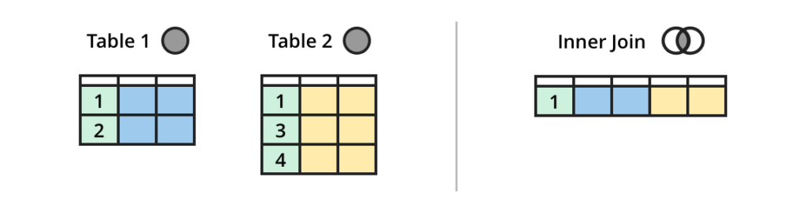
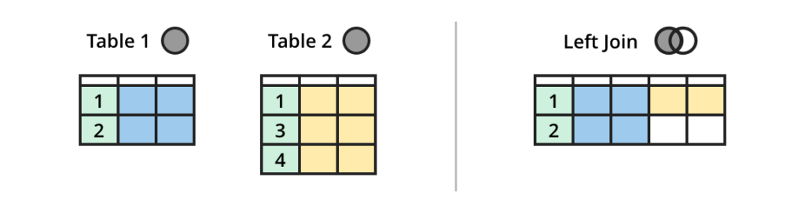
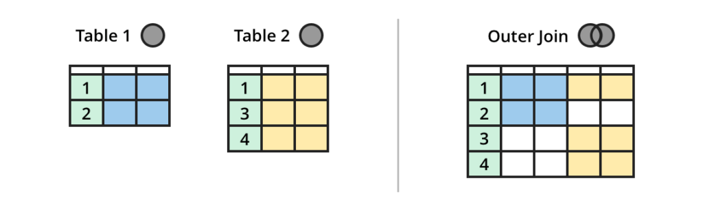
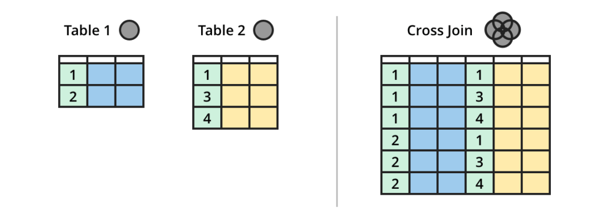

# SQL

## REQUEST STRUCTURE

| CMD        | DESCRIPTION                                                                                       |
|------------|---------------------------------------------------------------------------------------------------|
| `SELECT`   | определяет данные для извлечения                                                                  |
| `FROM`     | определяет таблицу для извлечения данных                                                          |
| `WHERE`    | определяет фильтрацию до агрегирования данных                                                     |                                                    
| `GROUP BY` | используется для определения групп выходных строк, к которым могут применяться агрегатные функции |
| `HAVING`   | определяет фильтрацию уже агрегированных данных                                                   |
| `ORDER BY` | определяет порядок вывода строк в запросе                                                         |

#### SELECT

```sql
SELECT -- / SELECT DISTINCT
    director,
    movie_title,
    10 - rating AS difference
FROM sql.kinopoisk
```

#### FROM

```sql
SELECT *
FROM
    sql.teams,
    sql.matches
```

#### WHERE

```sql
SELECT *
FROM sql.kinopoisk
WHERE (rating BETWEEN 8 AND 8.5 OR year < 1990)
    AND overview IS NOT NULL
    AND movie_title NOT LIKE 'Т%'
    AND movie_title LIKE '____________'
```

#### GROUP BY

```sql
SELECT
   type1 primary_type,
   count(DISTINCT type2) additional_types_count,
   AVG(hp) avg_hp,
   SUM(attack) attack_sum
FROM sql.pokemon
GROUP BY primary_type
ORDER BY additional_types_count DESC, primary_type
```

#### HAVING

```sql
SELECT
    type1, 
    COUNT(*)
FROM sql.pokemon
WHERE attack BETWEEN 50 AND 100 OR defense BETWEEN 50 AND 100
GROUP BY type1
HAVING MAX(hp) <= 125
ORDER BY COUNT(*) DESC
LIMIT 1 OFFSET 4
```

#### ORDER BY

```sql
SELECT
    director,
    movie_title
FROM sql.kinopoisk
ORDER BY year, rating DESC -- / ASC
OFFSET 3 LIMIT 1
```

#### LIMIT

```sql
SELECT *
FROM sql.kinopoisk
OFFSET 3 LIMIT 5
```

## AGGREGATE FUNCTIONS

#### COUNT / SUM / AVG / MIN / MAX

```sql
SELECT
    COUNT(*) pokemon_count,
    AVG(speed) avg_speed,
    MAX(hp) max_hp,
    MIN(hp) min_hp
FROM sql.pokemon
WHERE type1 = 'Electric'
    AND type2 IS NOT NULL
    AND (attack > 50 OR defense > 50)
```

## CREATE TABLE

| DATA TYPE          | Description                                                              |
|--------------------|--------------------------------------------------------------------------|
| `BIGINT`           | -9,223,372,036,854,775,808 ... 9,223,372,036,854,775,807                 |
| `INT`              | -2,147,483,648 ... 2,147,483,647                                         |
| `SMALLINT`         | 	-32,768 ... 32,767                                                      |
| `TINYINT`          | 0 ... 255                                                                |
| `BIT`              | 0 ... 1                                                                  |
| `DECIMAL`          | -10^38 +1 ... 10^38 -1                                                   |
| `NUMERIC`          | -10^38 +1 ... 10^38 -1                                                   |
| `MONEY`            | -922,337,203,685,477.5808 ... +922,337,203,685,477.5807                  |
| `SMALLMONEY`       | -214,748.3648 ... +214,748.3647                                          |
| `FLOAT`            | -1.79E + 308 ... 1.79E + 308                                             |
| `REAL`             | -3.40E + 38 ... 3.40E + 38                                               |
| `DATETIME`         | Jan 1, 1753 ... Dec 31, 9999                                             |
| `SMALLDATETIME`    | Jan 1, 1900 ... Jun 6, 2079                                              |
| `DATE`             | Дата сохраняется в виде June 30, 1991                                    |
| `TIME`             | Время сохраняется в виде 12:30 P.M.                                      |
| `CHAR`             | Строка длиной до 8,000 символов (не-юникод символы, фиксированной длины) |
| `VARCHAR`          | Строка длиной до 8,000 символов (не-юникод символы, переменной длины)    |
| `TEXT`             | Не-юникод данные переменной длины, длиной до 2,147,483,647 символов      |
| `NCHAR`            | Строка длиной до 4,000 символов (юникод символы, фиксированной длины)    |
| `NVARCHAR`         | Строка длиной до 4,000 символов (юникод символы, переменной длины)       |
| `NTEXT`            | Юникод данные переменной длины, длиной до 1,073,741,823 символов         |
| `BINARY`           | Данные размером до 8,000 байт (фиксированной длины)                      |
| `VARBINARY`        | Данные размером до 8,000 байт (переменной длины)                         |
| `IMAGE`            | Данные размером до 2,147,483,647 байт (переменной длины)                 |
| `TIMESTAMP`        | Уникальные числа, обновляющиеся при каждом изменении строки              |
| `UNIQUEIDENTIFIER` | Глобально-уникальный идентификатор (GUID)                                |
| `CURSOR`           | Объект курсора                                                           |
| `TABLE`            | Промежуточный результат, предназначенный для дальнейшей обработки        |

#### PRIMARY KEY / FOREIGN KEY

```sql
CREATE TABLE matches(
    id INT NOT NULL PRIMARY KEY,
    home_team_api_id INT NOT NULL FOREIGN KEY REFERENCES teams(api_id),
    away_team_api_id INT NOT NULL FOREIGN KEY REFERENCES teams(api_id)
    );
```

## JOIN OPERATIONS

| JOIN TYPE      | DESCRIPTION                                                                                                                                                                                                                                                                                                                |
|----------------|----------------------------------------------------------------------------------------------------------------------------------------------------------------------------------------------------------------------------------------------------------------------------------------------------------------------------|
| `JOIN`         | оператор SQL, который позволяет соединять таблицы по условию                                                                                                                                                                                                                                                               |
| `INNER JOIN`   | присоединяются только те строки таблиц, которые удовлетворяют условию соединения. Если в любой из соединяемых таблиц находятся такие строки, которые не удовлетворяют заявленному условию, — они отбрасываются.                                                                                                            |
| `LEFT JOIN`    | из левой (относительно оператора) таблицы сохраняются все строки, а из правой добавляются только те, которые соответствуют условию соединения. Если в правой таблице не находится соответствия, то значения строк второй таблицы будут иметь значение `NULL`.                                                              |
| `RIGHT JOIN`   | При использовании `RIGHT JOIN` сохраняется та же логика, что и для `LEFT JOIN`, только за основу берётся правая таблица                                                                                                                                                                                                    |
| `FULL JOIN`    | `FULL OUTER JOIN` объединяет в себе `LEFT JOIN` и `RIGHT JOIN` и позволяет сохранить кортежи обеих таблиц. Даже если не будет соответствий, мы сохраним все записи из обеих таблиц. <br> `FULL OUTER JOIN` может быть полезен в ситуациях, когда схема данных недостаточно нормализована и не хватает таблиц-справочников. |
| `CROSS JOIN`   | `CROSS JOIN` соединяет таблицы так, что каждая запись в первой таблице присоединяется к каждой записи во второй таблице, иначе говоря, даёт декартово произведение.                                                                                                                                                        |
| `NATURAL JOIN` | ключевое слово `NATURAL` в начале оператора `JOIN` позволяет не указывать условие соединения таблиц — для соединения будут использованы столбцы с одинаковым названием из этих таблиц                                                                                                                                      |
| `SELF JOIN`    | сравнения записей внутри одной и той же таблицы                                                                                                                                                                                                                                                                            |

#### INNER JOIN

```sql
SELECT
    m.id,
    t1.short_name home_short,
    t2.short_name away_short
FROM
    sql.matches m
    JOIN sql.teams t1 ON m.home_team_api_id = t1.api_id
    JOIN sql.teams t2 ON m.away_team_api_id = t2.api_id
ORDER BY 1
```



#### LEFT JOIN

```sql
SELECT
    DISTINCT t.long_name
FROM
    sql.teams t
    LEFT JOIN sql.matches m ON t.api_id = m.home_team_api_id or t.api_id = m.away_team_api_id
WHERE 
    m.id is not null
ORDER BY 1
```



#### RIGHT JOIN

```sql
SELECT
    DISTINCT t.long_name
FROM
    sql.matches m 
    RIGHT JOIN sql.teams t ON t.api_id = m.home_team_api_id or t.api_id = m.away_team_api_id
WHERE 
    m.id is not null
ORDER BY 1
```

#### FULL JOIN

```sql
SELECT
    t.long_name,
    m.id
FROM
    sql.teams t
    FULL JOIN sql.matches m on t.api_id = m.home_team_api_id
ORDER BY
    m.id DESC
```



#### CROSS JOIN

```sql
SELECT
    DISTINCT
    t1.short_name home_team,
    t2.short_name away_team
FROM
    sql.teams as t1
    CROSS JOIN sql.teams as t2
WHERE 
    t1.id != t2.id
ORDER BY 
    1, 2
```



#### NATURAL JOIN

```sql
SELECT
    t1.short_name home_team,
    t2.short_name away_team
FROM
    sql.teams as t1
    NATURAL JOIN sql.teams as t2
```

#### SELF JOIN

```sql
SELECT
    t1.short_name home_team,
    t2.short_name away_team
FROM
    sql.teams as t1
    JOIN sql.teams as t2 on t1.id = t2.id
```

## SMTH

```sql

```

```sql

```

```sql

```

```sql

```

```sql

```
